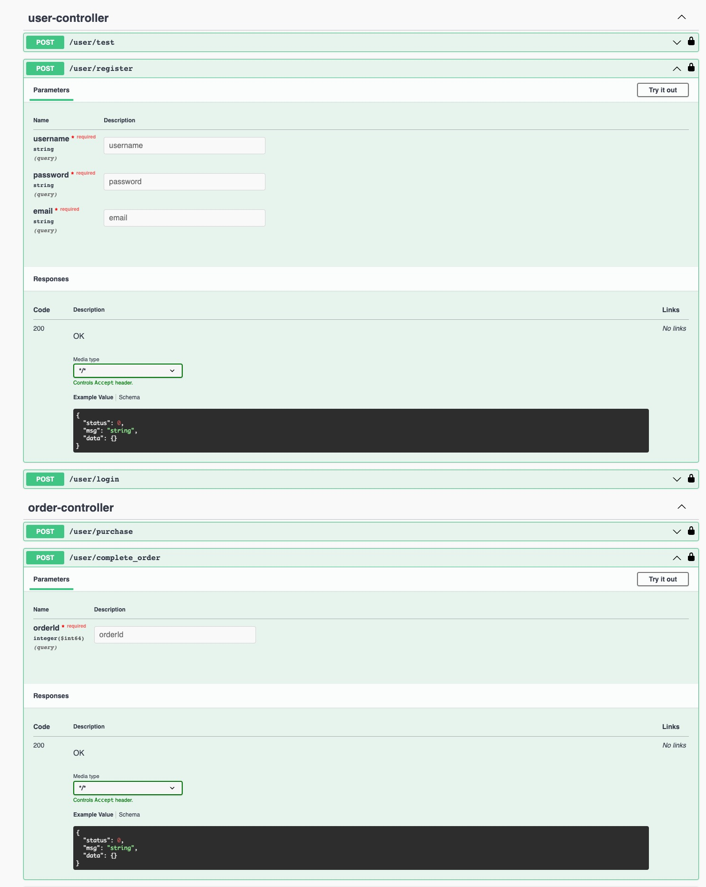

# shoppingApp_optimize
## Before run the project:
#### go to application.properties file and change the password:
#### database.hibernate.password= //change to your own database password

## Swagger：
#### swagger URL for this project

#### swagger examples

